# UML设计

## UML简介

​	统一建模语言（Unified Modeling Language, UML）是一种通用的**可视化**建模语言，可以用来描述、可视化、构造和文档化软件密集型系统的各种工作。

​	UML用来捕获系统**静态结构**和**动态行为**的信息。静态结构定义了系统中对象的属性和方法，以及这些对象间的关系。动态行为则定义了对象在不同时间、状态下的变化以及对象间的互相通信。

​	UML可以将模型组织为**包**的结构组件，使得大型系统可被分解成易于处理的单元。

​	UML的三位创始人对其做出了如下几点评价：

​		UML是凌乱的、不精确的、复杂的和松散的。

​		你不必知道或使用UML的每一项特征，其他的特征可以逐步学习，在需要时再使用。

​		UML能够并且已经在实际的开发项目中使用。

​		UML不只是一种可视化的表示方法，它还可以生成代码和测试用例（自动生成的代码很烂，几乎没人用）。

​		没有必要对所谓的UML专家的建议言听计从。

注意：

1. UML不是编程语言，不是框架，不是设计模式，它只是一个图形化文档
2. UML可以作为一个在编程方向上的指引，但需求可能在变，我们应该按照需求来设计编程
3. UML大部分作为需求文档上的草图出现
4. 在后续维护项目时，不需要直接看源码，可以通过UML来查看当时项目的设计思路进行维护

### 开发流程

1. 迭代和增量式开发

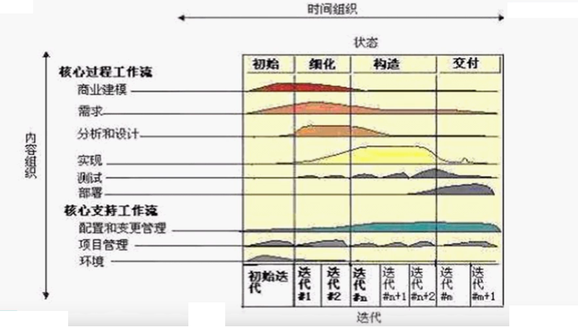

2. 瀑布生命周期

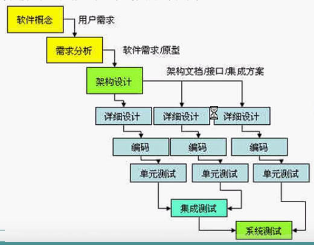

一是实际开发的流程，二是给客户看的流程，而UML设计贯穿整个流程

### UML的目标与应用范围

#### UML的目标

* 为建模者提供可用的、富有表达力的、可视化的建模语言，以开发和交换有意义的模型。

* 提供可扩展性和特殊化机制以延伸核心概念。

* 支持独立于编程语言和开发过程的规范。

* 为理解建模语言提供正式的基础。

* 推动面向对象建模工具市场的成长。
* 支持更高级的开发概念。

#### UML应用范围

​	UML以面向对象的方式来描述系统，最广泛的应用是对软件系统进行建模，但它同样适用于许多非软件系统领域的系统。从理论上说，任何具有**静态结构**和**动态行为**的系统都可以使用UML进行建模。当UML应用于大多数软件系统的开发过程中时，它从需求分析阶段到系统完成后的测试阶段都能起到重要作用。

​	在需求分析阶段，可以通过**用例**捕获需求。通过建立用例图等模型来描述系统的使用者对系统的功能要求。在分析和设计阶段，UML通过类和对象等主要概念及其关系建立静态模型，对类、用例等概念之间的协作进行动态建模，为开发工作提供详尽的规格说明。在开发阶段，将设计的模型转化为编程语言的实际代码，指导并减轻编码工作。在测试阶段，可以用UML图作为测试依据；用类图指导单元测试，用组件图和协作图指导集成测试，用用例图指导系统测试等。

## UML构造块

​	构造块指的是UML的基本建模元素，是UML中用于表达的语言元素，是来自现实世界中的概念的抽象描述方法。构造块包括**事物**、**关系**和**图**。

### 事物

​	事物是构成模型图的主要构造块，它们代表了一些面向对象的基本概念。

1. **结构事物**

   ​	结构事物通常作为UML模型的静态部分，用于描述概念元素或物理元素。结构事物总称为类元。常见的结构事物有类、接口、用例、协作、组件、节点等。

   ​	类：对具有相同属性、相同操作、相同关系和相同语义的一组对象的描述。在UML图中使用矩形表示类，核心内容包括类名、属性、方法（操作）。

   ​	接口：是一组操作的集合，这些操作包括类或组件的动作，描述了元素的外部可见行为。接口仅仅定义操作的数量和特征，但不提供具体的实现方法。接口可以被类所继承，继承了某接口的类必须提供该接口所有操作的实现。接口一般不需要属性。在UML中接口的声明也使用矩形描述，在接口名上方使用构造型`<<interface>>`与类做区分。

   ​	协作：定义一个交互，它是在为实现某个目标而共同工作、相互配合的多个元素之间的交互动作。

   ​	用例：描述一组动作序列。这些动作序列将作为服务由特定的参与者触发或执行，在执行过程中产生有价值、可观察的结果，结果可反馈给参与者或作为其他用例的参数。在UML图中用例表示为实线椭圆，仅包含名称。

   ​	组件：系统中封装好的模块化组件，仅将外部接口暴露出来，内部实现被隐藏。在UML图中将组件表示成矩形框，左边框上附着两个小矩形，框内写组件名。（下图不实）

   ​	节点：在软件部署时需要的物理元素，其本质为一种计算机资源。在UML图中节点用一个立方体表示，仅包含名称。

   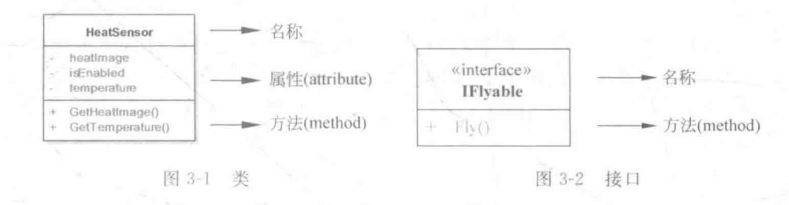

2. **行为事物**

   ​	行为事物也称为动作事物，是UML模型的动态部分，用于描述UML模型的动态元素，主要为静态元素之间产生的时间和空间上的动作，类似于句子中动词的作用。常见的行为事物有交互、状态机、活动等。

   ​	交互：描述一种行为，它产生于协作完成一个任务的多个元素之间。交互包含信息、状态和连接。在UML图中消息表示为**实箭头**，源自消息发出者，指向接收者，箭头上方写操作名。

   ​	状态机：定义了对象或行为的生命周期内的状态转移规则。状态机中含状态、转移、条件（事物）以及活动。UML图中的状态机表示为圆角矩形，包含状态名。

   ​	活动：描述了一个操作执行时的过程信息。一个活动包含在操作执行过程中的每一个步骤（动作）之间的先后序列关系。UML图中的活动也表示为圆角矩形，它和状态机图例的区分依靠语义。

   

3. 分组事物

   分组事物又称组织事物，主要的分组事物是包。

4. 注释事物

   注释事物又称辅助事物，是UML模型的解释部分。

   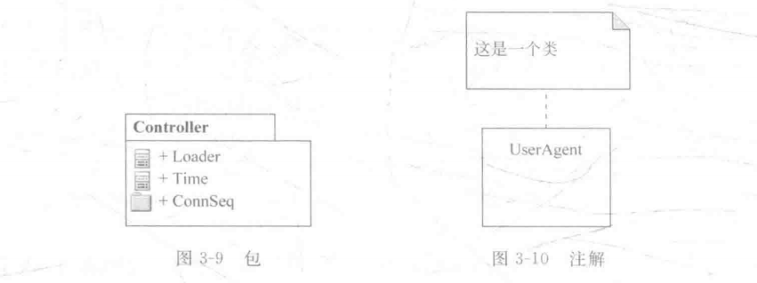

注：

### 关系

* **关联：**描述不同类元的实例之间的连接。它是一种结构化的关系，指一种对象和另一种对象之间存在联系，即“从一个对象可以访问另一个对象”。关联中还有一种特殊情况，称作**聚合关系**，聚合表示两个类元的实例具有整体和部分的关系，表示整体的模型元素可能是多个表示部分的模型元素的聚合。例如，一个汽车和四个轮胎会构成关联关系，而这种关联关系同时又是聚合关系。在UML图中用单实线或单实线箭头来表示。
* **依赖：**描述一对模型元素之间的内在联系（语义关系），若一个元素的某些特性随某一个独立元素的特性的改变而改变，则这个元素不是独立的，它依赖于上文所给的那个独立元素。在UML图中用虚线箭头来表示。
* **泛化：**类似于面向对象方法中的继承关系，是特殊到一般的一种归纳和分类，泛化可以添加约束条件，说明该泛化关系的使用方法或扩充方法，称为受限泛化。在UML图中用三角实线箭头来表示。
* **实现：**描述规格说明和其实现的元素之间的连接的一种关系。其中规格说明定义了行为的说明，真正的实现由后一个模型元素来完成。在UML图中用三角虚线箭头来表示。

### 图

​	当用户选择了模型所需的事物和关系之后，就需要将模型展示出来；这种展示就是通过UML的图来实现。图是一组模型元素的图形表示，是模型的展示效果。

​	根据UML图的基本功能和作用，可以将其划分为两大类：结构图和行为图。结构图捕获事物与事物之间的静态关系，用来描述系统的静态结构模型；行为图则捕获事物的交互过程如何产生系统的行为，用来描述系统的动态行为模型。

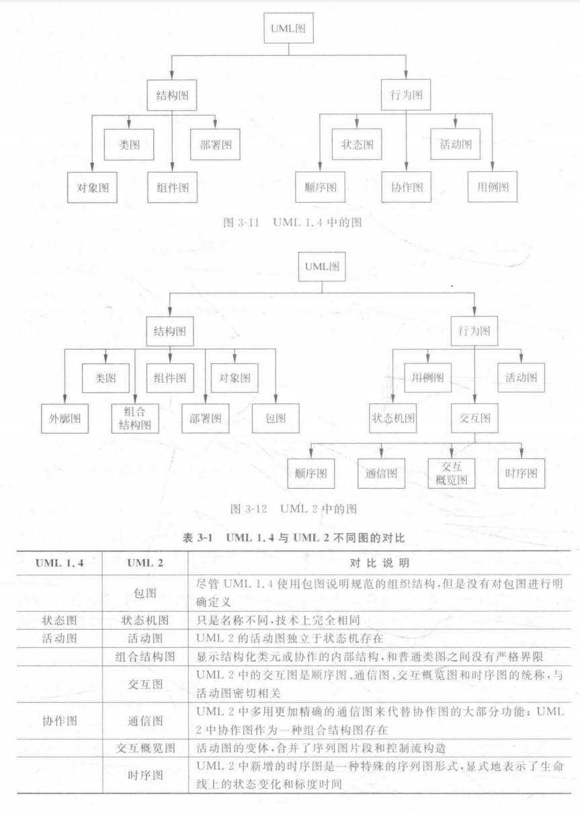

### “4+1”架构

​	RUP“4+1”架构方法采用用例驱动，在软件生命周期的各个阶段对软件进行建模，从不同视角对系统进行解读，从而形成统一软件过程架构描述。

​	在这个视图模型中，软件开发者从五个不同视角描述软件体系结构的一组视图模型。它们包括**逻辑视图**、**开发视图**、**进程试图**、**物理视图**和**场景视图**。**每个视图只反应系统的某一部分，五个视图结合起来才可以描述整个系统的结构。**

​	逻辑视图将系统功能进行分解，它负责反映出系统内部是如何组织和协作来实现功能的。逻辑视图主要对应着UML的类图。

​	开发视图主要用来描述软件的各个模块的组织方式，包括源程序、程序包、支持软件、第三方等。对应到UML中，由于其描述了静态的软件组织结构，一般由有着相似功能的组件图（组件与子系统）表达。

​	进程视图主要描述系统的运行特性，侧重系统的性能和稳定性，关心系统的并发性、分布性、集成性的好坏，主要关注进程、线程、对象、并发、同步、通信等运行时概念。在UML中运行时分析一般采用顺序图、协作图、状态机图来完成。

​	物理视图主要描述硬件配置，强调系统的安装、配置、通信、拓扑结构等问题。在UML中的部署图基本可以实现以上物理视图涉及的部分。

​	场景视图从项目需求入手，将四个视图结合为一个整体。

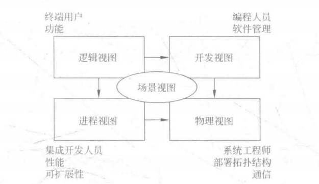

## 用例图 ☆☆

> 在软件开发过程中，首先解决的问题就是捕获并分析客户的需求，此时可以通过用例和用例图来形象地表示出所有需求。用例建模就是用来描述系统功能的技术。

### 简介

​	用例图是表示一个系统中**用例**与**参与者** **关系**之间的图。它描述了系统中相关的用户和系统对不同用户提供的功能和服务。用例图是UML中对系统的动态方面建模的五种图之一，是对系统、子系统和类的行为进行建模的**核心**。

​	用例图就相当于从用户的视角来描述和建模整个系统，分析系统的功能与行为。

​	用例图中的主要元素包括**参与者**、**用例**以及元素之间的**关系**。此外，用例图还可以包括注释和约束。

​	下图是一个图书管理系统的用例图。

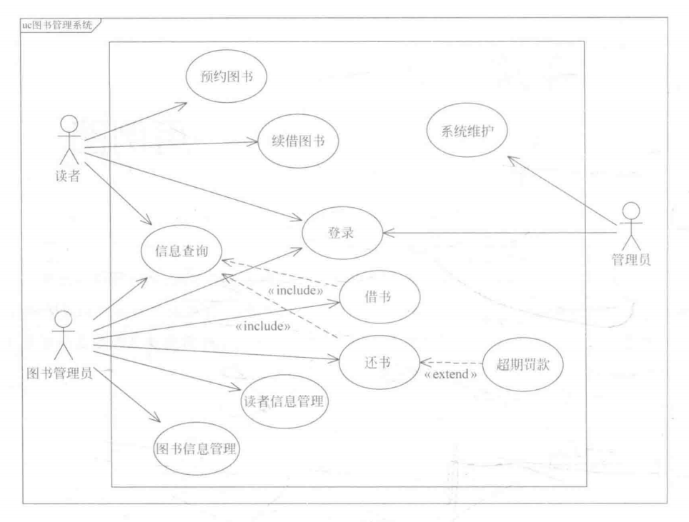

### 组成元素

1. **参与者**

   ​	参与者也被译为执行者，是与系统主体交互的外部实体的类元，描述了一个或一组与系统产生交互的外部用户或外部事物。参与者以某种方式参与系统中一个或一组用例的执行。

   ​	**参与者位于系统边界之外，而不是系统的一部分。**也就是说，参与者是从现实世界中与系统有交互的事物中抽象出来的，而并非系统中的一个类。例如，某个用户登录了某一网站，网站存储有这个用户的个人信息。在这一例子中，这个用户可以抽象成系统的参与者，而数据库中存储的个人信息纪录则是系统内部的一个对象。

   ​	参与者可以用如下方式表示。（一般都是以小人表示）

   

   如何确定参与者？

   - 为系统提供输入的人或事物
   - 接收系统输出的人或事物
   - 需要接入的第三方系统或设备
   - 时间是否会触发某些事件
   - 负责支持或维护系统中信息的人

2. **用例**

   ​	用例是类元（一般是系统、子系统或类）提供的一个内聚的**功能单元**，表明系统与一个或多个参与者之间信息交换的顺序，也表明了系统执行的动作。

   ​	用例用如下方式表示。

   

   ​	参与者与用例是用例图中最主要的两个元素，二者也存在着密不可分的关系。

   用例的特征：

   1. 用例是动宾短语
   2. 用例是相互独立的
   3. 用例是由参与者启动的
   4. 用例要有可观测的执行结果
   5. 一个用例是一个单元

   ​	用例粒度指的是用例组织信息的方式和细化程度。例如，我们允许用户修改自己的用户名、密码、联系电话和地址等信息。

   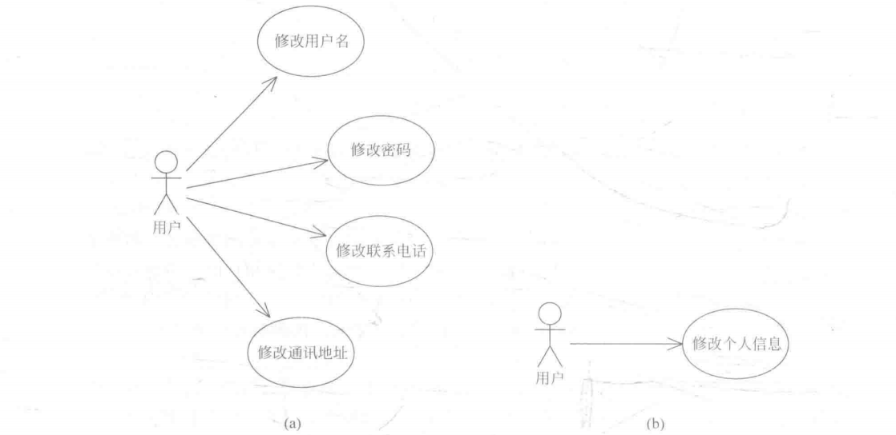

   ​	我们可以说（a）的用例粒度比（b）要细。

   ​	用例粒度实际上是一个“度”的概念。在实际建模过程中，并没有一个标准的规则，我们这确定用例时完全不需要为此所困，而需要根据当前阶段的具体需求来进行。需要注意的是，不管用例的粒度大小如何，都要符合上面提到的用例特征，否则就违背了用例的思想。

### 用例图中的关系

1. 参与者间的泛化关系

   

2. 参与者与用例的关联关系

   

3. 用例间的泛化关系

   

4. 用例间的依赖关系

   1) 包含

   ​	包含指的是一个用例（基用例）可以包含其他用例（包含用例）具有的行为，其中包含用例中定义的行为将被插入基用例定义的行为中。使用包含要遵循两个约束：

   1. 基用例可以看到包含用例，并需要依赖于包含用例的执行结果，但是它对包含用例的内部结构没有了解
   2. 基用例一定会要求包含用例执行，即对包含用例的使用是无条件的。

   

   ​	如图，创建订单包含选择商品，即创建订单必须先选择商品。由基用例指向包含用例，并标注`<<include>>`。

   2) 扩展

   ​	扩展指的是一个用例（扩展用例）对另一个用例（基用例）行为的增强。在这一关系中，扩展用例包含了一个或多个片段，每个片段都可以插入到基用例中的一个单独的位置上，而基用例对于扩展的存在是毫不知情的。使用扩展用例，可以在不改变基用例的同时，根据需要自由地向用例中添加行为。

   

   ​	如图，检查实名信息是注册的扩展，当你输入实名信息时扩展用例执行，否则是不执行的，而注册用例本身对扩展用例是不知情的，即它不需要检查实名信息的结果就可以继续执行。扩展由扩展用例指向基用例，并标注`<<extend>>`。

   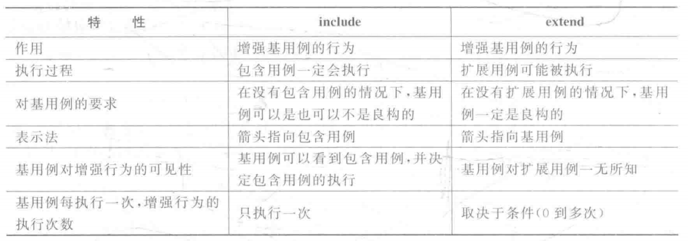

### 用例描述

> ​	**用例关注的是一个系统需要做什么（what），而并非如何做（how）。**也就是说，用例本身并不能描述一个事件或交互的内部过程，这对软件开发来说是不够充分的。因此，我们可以通过使用足够清楚的、便于理解的文字来描述一个事件流，进而说明一个用例的行为。一个完整的用例模型应该不仅仅包括用例图部分，还要有完整的用例描述部分。

一般用例描述包括以下几部分内容：

* 用例名称 -- 描述用例的意图或实现的目标，一般为动词或动宾短语。
* 用例编号 -- 用例的唯一标识符，在其他位置可以使用该标识符来引用用例。
* 参与者 -- 描述用例的参与者，包括主要参与者和其他参与者。
* 用例描述 -- 对用例的一段简单的概括描述。
* 触发器 -- 触发用例执行的一个事件。例如，“生成订单”用例的触发器是“用户提交了一个新订单时”。
* 前置条件 -- 用例执行前系统状态的约束条件。
* 基本事件流（典型过程） -- 用例的常规活动序列，包括参与者发起的动作与系统执行的响应活动。
* 扩展事件流（替代过程） -- 纪录如果典型过程出现异常或变化时的用例行为，即典型过程以外的其他活动步骤。
* 结论 -- 描述用例何时结束。例如，“生成订单”的结论是“用户收到订单确定的通知后”。
* 后置条件 -- 用例执行后系统状态的约束条件。
* 补充约束 -- 用例实现时需要考虑的业务规则、实现约束等信息。

下图是 提交订单 - 用例的用例文档示例

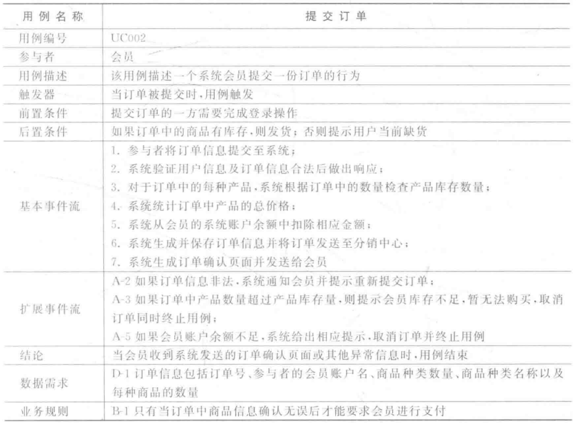

### 总结

1. 类不等于参与者。
2. 用例是功能单元。
3. 参与者间只有一种泛化关系，意为延伸。
4. 参与者与用例之间的关联，可以是单向，也可以是不确定方向的。
5. 用例的依赖关系有包含（include）和扩展（extend）两种。包含是基用例指向包含用例，而扩展是指向基用例，方向相反。包含是需要包含用例的结果，所以必执行；扩展是增强，所以是非必须。
6. 用例一定要有用例文档

### 实验：绘制机票预订系统的用例图

1. 情景说明

   ​	机票预订系统是某航空公司推出的一款网上购票系统。其中，未登录的用户只能查询航班信息，已登录的用户还可以网上购买机票，查看已购机票，也可以退订机票。系统管理员可以安排系统中的航班信息。此外，该购票系统还与外部的一个信用评价系统有交互。当某用户一个月之内退订两次及以上的机票时，需要降低该用户在信用评价系统中的信用等级。当信用等级过低时，则不允许该用户再次购买机票。

2. 确定参与者

   ​	根据系统的背景说明，我们可以分析出需要订票的用户肯定要参与其中，并且用户根据是否已登录有不同的系统使用权限。负责安排航班信息的管理员和系统产生交互的外部信用评价系统也应该属于系统的参与者。

   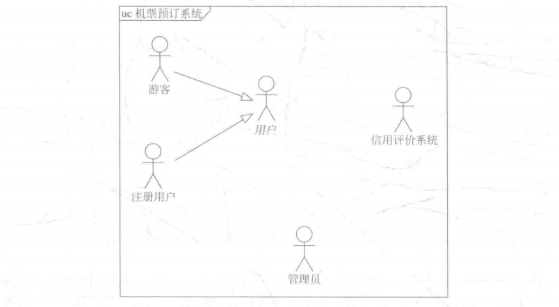

3. 确定用例

   ​	在确定参与者之后，我们可以通过分析每个参与者是如何使用系统来确定系统中的用例。在本系统中，游客可以注册系统和查询航班信息；注册用户可以登录系统、查询航班信息、购买机票、查看行程和退订机票；管理员可以登录系统和设定航班安排；信用评价系统可以修改和检查信用等级。需要注意的是，修改和检查信用等级的用例并非使用信用评价系统主动触发的，信用评价系统对这两个用例而言只是副参与者。

   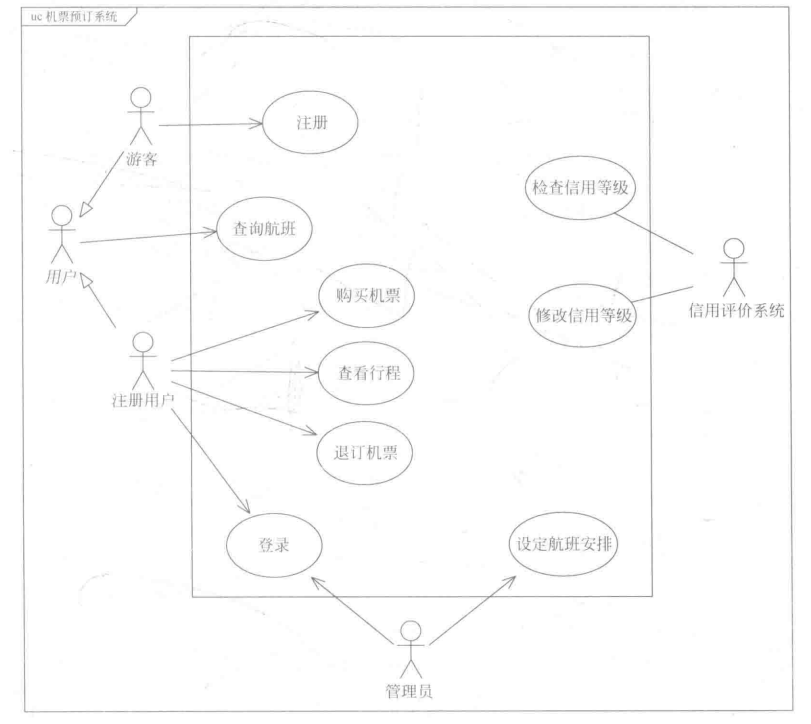

4. 确定用例之间的关系

   ​	在确定完所有用例之后，需要具体考虑各个用例的工作流程从而添加用例之间的依赖关系，以此保证模型的高聚合与低耦合。对于此系统，我们注意到“购买机票”用例在执行时需要先查询相关的航班信息然后再选择感兴趣的航班购票，并且在购票前需要检查该用户的信用等级是否足够的高，因此该用例与“查询航班”用例和“检查信用等级”用例之间可以分别建立包含关系。此外，在退订机票时，如果这是该用户本月第二次以上的退订，那么需要降低该用户的信用等级，由于这一关系是有条件的，所以二者构成扩展关系。

   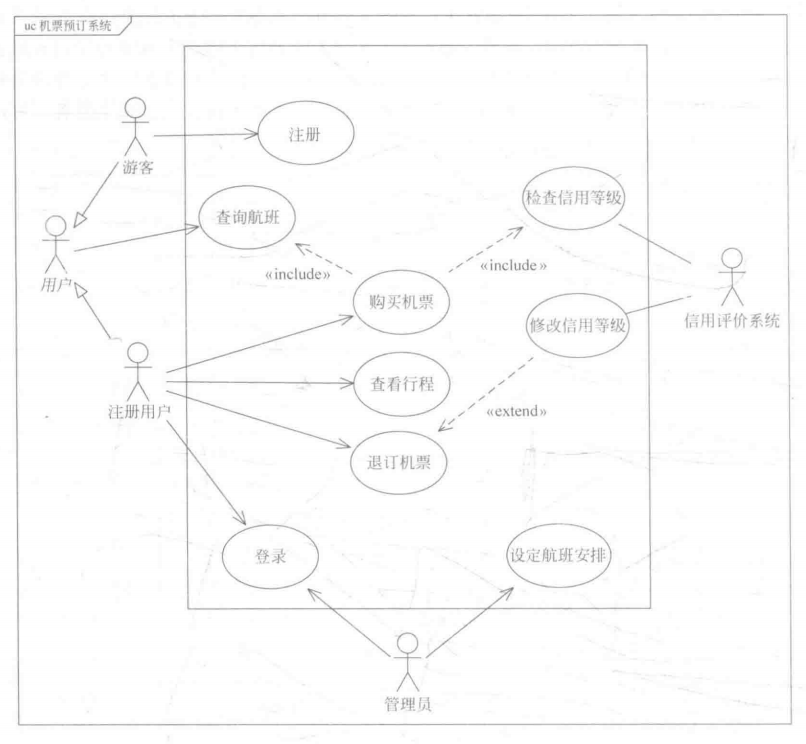

   这就是本系统的最终用例图。

## 类图 ☆

> ​	类图用来描述系统内各种实体的类型以及不同的实体之间是如何彼此关联的，显示了系统的内部静态结构，因此类图的描述对于系统的整个生命周期都是有效的。
>
> ​	如果用例图是系统的“面子”，那么类图就是系统的“里子”。

### 简介

​	类图是显示一组**类**、**接口**、**协作**以及它们之间**关系**的图。类图主要通过系统中的**类以及各个类之间的关系**来描述系统的**静态结构**。

​	类图与数据模型有许多相似之处，区别就在于类不仅描述了系统内部信息的结构，也包含了系统的**内部行为**，系统通过自身行为与外部事物进行交互。

​	类图主要包含七种元素：类、接口、协作、依赖关系、泛化关系、实现关系和关联关系。与其它UML图类似，类图同样可以创建约束和注释等。

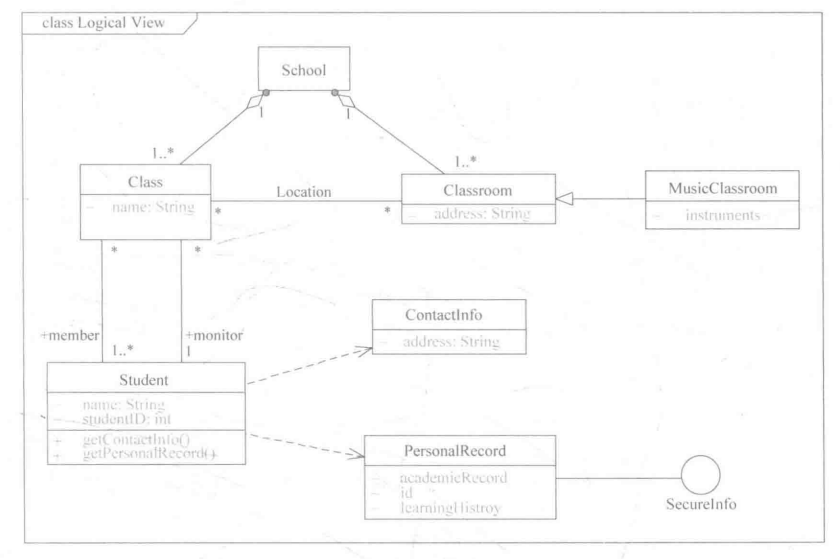

​	上图描述的是学生上课的类图。看不懂没关系，接着往下看。

### 类

​	类是一组拥有相同属性、操作、方法、关系和行为的对象描述符。

​	类定义了一组有着状态和行为的对象。类的状态由属性和关联来描述，个体行为由操作来描述，对象的生命周期则由附加给类的状态机来描述。

​	在UML中，类表达成一个有三个分割区的矩形。其中顶端显示类名，中间显示类的属性，尾端显示类的操作。其中，可选择显示属性和操作的可见性、属性类型、属性初始值、操作的参数列表和操作的返回值等信息。此外，也可以选择隐藏类的属性或操作部分。

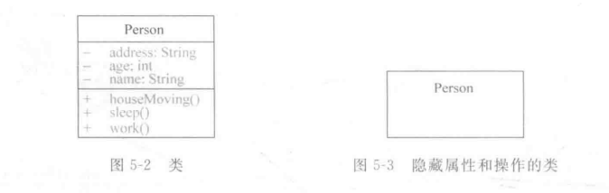

1. 类名

   ​	每个类都必须有一个区别于其他类的名称。按照一般约定，类名一般采用大驼峰命名法，即以大写字母开头，大小写混合，每个单词首字母大写，避免使用特殊符号。

   ​	类名有两种表示方法：使用单独的名称叫做简单名；在类名前边加上包的名称，如java::awt::Person，叫做路径名。

2. 属性

   ​	属性是已被命名的类的特性，它描述了该特性的实例可以取值的范围。

   ​	在UML中，描述一个属性的语法格式为：

   ​	[ 可见性 ] 属性名 [ : 类型 ] \[ 多重性 ] [ = 初始值 ] \[ {特性}]

   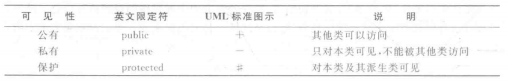

   ​	例如， - numbers:int[3] = [1,2,3]{changeable}，这个属性是私有的，int数组类型，属性名为numbers，初始值为[1,2,3]，可以随便修改没有约束。

   ​	属性一栏除了属性名都可以忽略不写。

   UML定义了三种可以用于属性的特性：

   * 可变（changeable）表示属性可以随便修改，没有约束；
   * 只增（addOnly）表示该属性修改时可以增加附加值，但不允许对值进行消除或进行减的改变；
   * 冻结（frozen）表示在初始化对象后，就不允许改变属性值。

   **属性权限：**

   | 名字      | 自身类 | 同包其他类 | 非同包子类 | 非同包其他类 |
   | --------- | ------ | ---------- | ---------- | ------------ |
   | public    | √      | √          | √          | √            |
   | protected | √      | √          | √          |              |
   | 默认      | √      | √          |            |              |
   | private   | √      |            |            |              |

3. 操作

   ​	操作是一个可以由类的对象请求以影响其行为的服务的实现，也即是对一个对象所做的事情的抽象，并且由这个类的所有对象共享。操作是类的行为特征或动态特征。

   ​	在UML中，描述一个操作的语法格式为：

   ​	[ 可见性 ] 操作名 [ (参数列表) ] \[ : 返回类型] [ {特性} ]

   ​	例如，+ findUserInfo(id : int) : User {isQuery} ，这个操作是公共的，操作名是findUserInfo，参数是int类型的，返回一个User对象，操作的执行不会改变系统的状态。

   UML定义了三种可以用于操作的特性：

   * 叶子（leaf）：操作不是多态的，即不能被重写。
   * 查询（isQuery）：操作的执行不会改变系统的状态。
   * 顺序（sequential）：调用者必须协调好外部的对象，以保证在一个对象中一次仅有一个流。在多控制流的情况下，不能保证对象的语义和完整性。
   * 监护（guarded）：在多控制流的情况下，通过将对象的各监护操作的所有调用进行顺序化来保证对象的语义和完整性。其效果是一次只能调用对象的一个操作，这又回到了顺序语义。
   * 并发（concurrent）：在多控制流的情况下，通过把操作作为原子来保证对象的语义和完整性。

### 接口

​	接口是一个被命名的操作集合，用于描述类或组件的一个服务。接口不同于任何类或类型，他不描述任何结构，因此不包含任何属性；也不描述任何实现，因此不包含任何实现操作的方法。像类一样，接口可以有一些操作。一个类可以支持多个接口，多个接口可以是互斥的，也可以是重叠的。

​	接口就像是“一张借条”，而实现类则可以比喻成“借条兑换成的现金”，接口代表了一份契约，实现该接口的类元必须履行它。

### 类图中的关系

1. 关联关系

   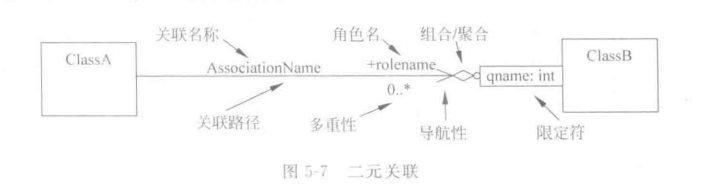

   1）关联名称：关联可以有一个名称（非必须）。

   2）角色：角色名放在靠近关联端的部分，表示该关联端连接的类在这一关联关系中担任的角色。可以用符号“+“、”#”、“-”修饰角色的可见性。

   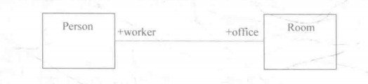

   3）多重性：同样放在靠近关联端的部分，表示在关联关系中源端的一个对象可以和目标类的多少个对象之间有关联。

   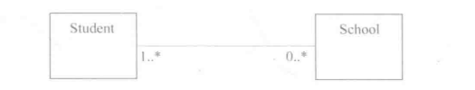

   4）导航性：是一个布尔值，用来说明运行时刻是否可能穿越一个关联。即从一个关联端的一个值获取另一个关联端的一个或一组值。

   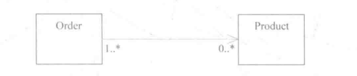

   5）限定符：是二元关联上的属性组成的列表的插槽，其中的属性值用来从整个对象集合里选择一个唯一的关联对象或者关联对象的集合。（用的较少）

   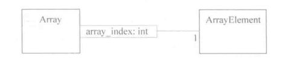

   6）关联的约束

   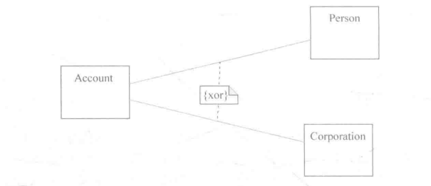

   上图表示两个关联关系存在异或约束，即公司和个人不允许拥有同一个银行账户。

   7）**特殊的关联 --- 聚合与组合**

   ​	聚合与组合都是关联关系中描述“整体 -- 部分”关系的特殊关联关系。

   ​	聚合关系没有改变整体与部分之间整个关联的导航含义，也与整体和部分的生命周期无关。也就是说，在聚合关系中，“部分”可以独立于“整体”存在。例如，课桌和教室，当教室不存在时，课桌也可以作为其他用途。

   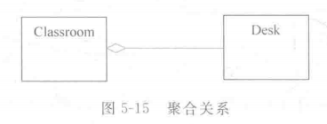

   ​	另外，聚合关系的实例应该具有传递性与反对称性。

   ​		传递性：A和B聚合关系，B和C聚合关系，那么A和C之间也存在一条链。

   ​		反对称性：聚合关系可以成环，聚合关系的实例不能成环。

   ​	组合关系是一种更强形式的聚合关系，又被称为强聚合。在组合关系中的部分要完全依赖于整体。这种依赖性主要表现在两个方面：部分对象在某一特定时刻只能属于一个组合（整体）对象；组合对象与部分对象具有重合的生命周期，组合对象销毁时，所有从属部分必须同时销毁。

   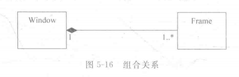

   ​	在实际建模过程中，使用组合还是聚合，需要根据应用场景和需求分析描述的上下文来灵活确定。其实，聚合和组合对绝大多数面向对象的编程语言来说，并没有实质的区别，因此不必过于执着于此。

   8）派生关联：属于一种派生元素，他不增加语义信息，只是一种可以由两个或两个以上的基础关联推算出来的虚拟关联。例如，一个人为某个部门工作，而此部门又属于某公司，则可以得出这个人是在为此公司工作，表示为派生关系Person.employer = Person.department.employer。（尽量少用）

   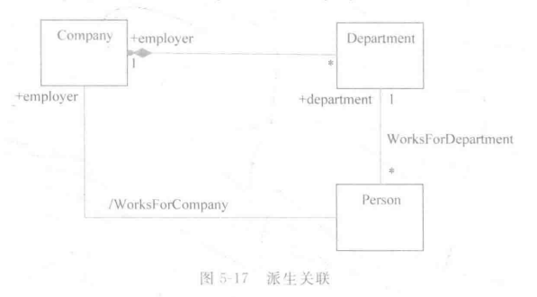

2. 泛化关系

## 对象图

## 包图

## 顺序图 △

## 通信图 △

## 状态机图 △

## 活动图 ☆

## 组件图

## 部署图

